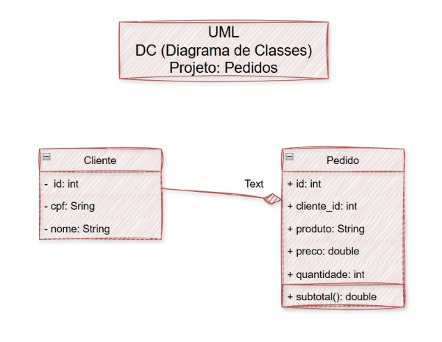
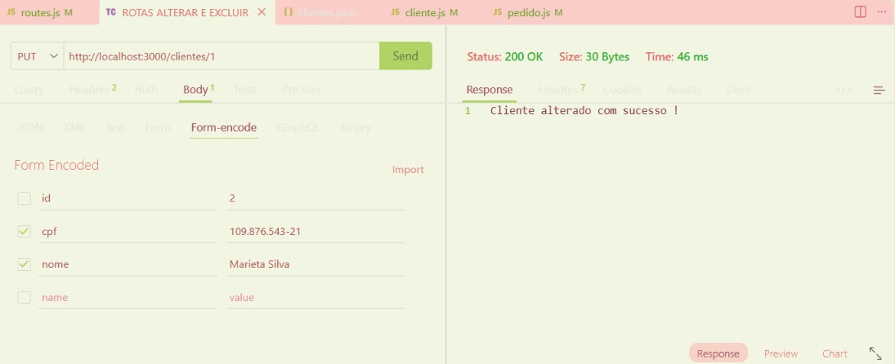
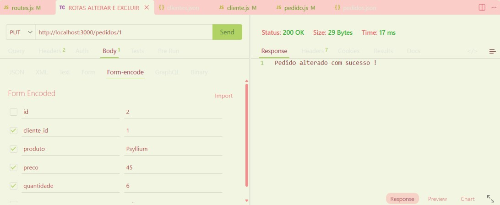
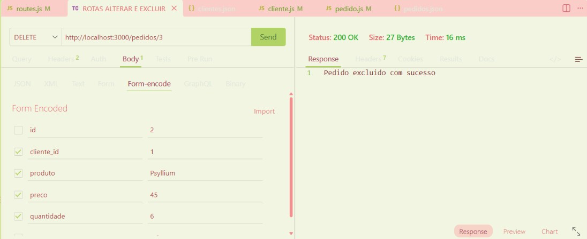

# Pedidos Backend MVC DC
Back-end com duas coleções mockup JSON e pedidos, CRUD, para aprender, MVC e UML diarama de classes

## Diagrama


## Tecnologias
- Node.js
- VsCode (Thunder Client)
- JavaScript
- MVC

## Passos para testar
- Clone este repositório e abra com VsCode
- Instale as dependências e execute com os seguintes comandos no terminal:
```
npm install
npm run dev
```

## Testes:

- Alterar cliente


- Excluir cliente


- Alterar pedido


- Excluir Pedido
